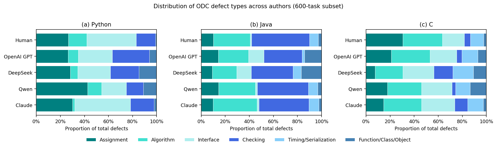
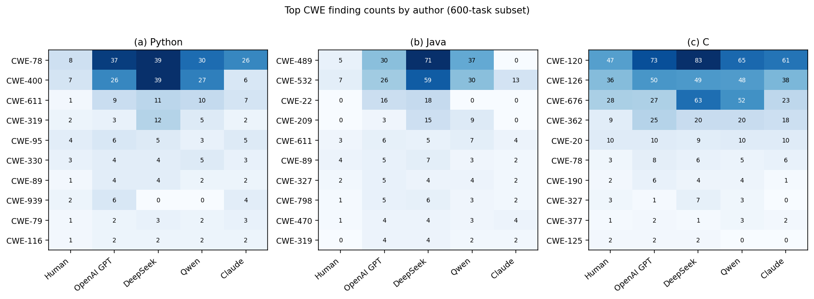

# Claude Opus 4.8 — results in the paper's format

Presented in the layout of *Code Quality Benchmark: Human-written vs. AI-generated*
(RQ1 structural complexity → Table 4 / Fig. 3; RQ2 defects → Fig. 6 + Table 5;
RQ3 security → Fig. 8). **Claude Opus 4.8 is added as a fifth author** alongside Human,
OpenAI GPT, DeepSeek, Qwen.

> Scope: computed on the **600-task stress subset** (200/language), *not* the full corpus,
> so absolute magnitudes differ from the paper's population tables; the cross-author
> ordering is the comparable signal. Structural means are over strict-nontrivial functions.
> Scored with the **study-aligned analyzer pipeline** (clang-tidy `--checks=*`, Semgrep
> Java-wrapping + error-discard, PMD `error_recovery`).

Figures (`paper_figures/`):
- `fig_structural_complexity.png` — RQ1, grouped bars (NLOC / CCN / Halstead V).
- `fig_odc_defect_distribution.png` — RQ2, proportion of total defects by ODC type (paper Fig. 6).
- `fig_cwe_heatmap.png` — RQ3, top-CWE counts by author (paper Fig. 8).

---

## RQ1 — Structural complexity (paper Table 4 format)

Mean per author (strict-nontrivial functions). NLOC=lines, CCN=cyclomatic, PC=params,
MND=max nesting, V=Halstead volume, D=Halstead difficulty, MI=maintainability index.
**Bold** = closest to the Human reference per metric per language.

| Language | Author | NLOC | CCN | PC | MND | V | D | MI |
|----------|--------|-----:|----:|---:|----:|--:|--:|---:|
| **Python** | Human | 13.43 | 3.76 | 3.12 | 1.28 | 681 | 15.6 | 59.1 |
| | OpenAI GPT | 5.06 | 1.90 | 2.35 | 0.66 | 231 | 9.6 | 70.9 |
| | DeepSeek | 7.79 | 2.40 | 2.94 | 1.02 | 344 | 12.4 | 65.7 |
| | Qwen | 10.48 | 3.18 | 2.77 | 1.16 | 544 | 15.3 | 61.9 |
| | **Claude** | **13.26** | **3.66** | **3.10** | **1.30** | **588** | 17.4 | **58.2** |
| **Java** | Human | 15.30 | 3.42 | 1.59 | 1.17 | 671 | 16.3 | 57.8 |
| | OpenAI GPT | 12.64 | 2.80 | 1.48 | 1.48 | 472 | 16.4 | 58.0 |
| | DeepSeek | 10.30 | 2.47 | 1.43 | 1.13 | 407 | 14.3 | 61.8 |
| | Qwen | 12.39 | 3.14 | 1.47 | 1.35 | 520 | 16.2 | 59.3 |
| | **Claude** | **14.52** | **3.80** | **1.57** | 1.48 | **617** | 17.4 | **57.3** |
| **C** | Human | 29.61 | 7.06 | 2.56 | 1.31 | 1201 | 27.0 | 48.8 |
| | OpenAI GPT | 19.42 | 6.60 | 2.54 | 1.27 | 842 | 28.0 | 52.2 |
| | DeepSeek | 12.21 | 3.11 | 2.12 | 1.08 | 439 | 16.9 | 58.9 |
| | Qwen | 16.92 | 4.01 | 2.42 | 1.36 | 650 | 21.6 | 55.3 |
| | **Claude** | **23.30** | **6.12** | **2.54** | 1.09 | **907** | **27.5** | **50.6** |

**Finding.** The paper's headline RQ1 result is that AI code is *structurally compressed* —
smaller/simpler than human code. **Claude reverses that**: on every language it is the closest
author to the human reference in size (NLOC), branching (CCN), parameters, and Halstead
volume, and has the lowest (most human-like, i.e. least inflated) maintainability index of
the AI authors. The older LLMs remain compressed (esp. DeepSeek); Claude does not.

---

## RQ2 — Defects (paper Fig. 6 + Table 5 format)

**Table 5 — defect statistics (600-subset; n=200/language).** Defective% = tasks with ≥1
defect; Vulnerable% = tasks with ≥1 Semgrep finding; Total Defects = summed findings.
**Bold** = best (lowest) per language.

| Language | Author | Defective % | Vulnerable % | Total Defects |
|----------|--------|------------:|-------------:|--------------:|
| **Python** | Human | 62.0 | **15.5** | 284 |
| | OpenAI GPT | 68.0 | 48.5 | 296 |
| | DeepSeek | 89.5 | 54.5 | 480 |
| | Qwen | 85.5 | 41.5 | 649 |
| | **Claude** | **63.0** | 28.0 | **239** |
| **Java** | Human | **57.5** | **12.5** | **268** |
| | OpenAI GPT | 86.0 | 42.0 | 542 |
| | DeepSeek | 94.5 | 59.5 | 699 |
| | Qwen | 70.5 | 36.0 | 466 |
| | **Claude** | 64.5 | 16.0 | 313 |
| **C** | Human | 72.0 | **40.0** | 395 |
| | OpenAI GPT | 75.5 | 59.5 | 389 |
| | DeepSeek | 89.5 | 62.0 | 463 |
| | Qwen | 80.5 | 56.5 | 469 |
| | **Claude** | **68.5** | 46.5 | **381** |

**Finding.** Claude has the lowest total defect count in Python and C and the lowest
defective-sample rate in Python and C; in Java it trails only Human. Its ODC *mix*
(Fig. 6) mirrors Human — low Function/Class/Object and Checking share — whereas DeepSeek/Qwen
skew toward Checking and structural (Function/Class/Object) defects.

---

## RQ3 — Security vulnerabilities (paper Fig. 8 format)

Top CWE finding counts by author, per language (extracted from the raw Semgrep results via
the benchmark's own loader). Vulnerability incidence (≥1 CWE / 600): Human 0.23, **Claude 0.30**,
Qwen 0.45, OpenAI 0.50, DeepSeek 0.59.

**Finding.** Claude's vulnerability incidence is second only to Human and well below the other
AI authors. The gap to the weaker models is dominated by *hygiene* weaknesses they emit and
Claude/Human almost never do — CWE-489 (leftover debug code: Claude 0 vs DeepSeek 71/37 in
Python-Java), CWE-532 (secrets in logs), CWE-22 (path traversal: Claude 0), and CWE-676
(unsafe C functions). Everyone's top C categories are the intrinsic memory-safety patterns
CWE-120/126, where Claude is mid-pack. Claude's relative weak spot is CWE-78 (OS command
injection), where it exceeds the Human reference.

---

## Summary

Across all three RQ dimensions, **Claude Opus 4.8 breaks the paper's human-vs-AI pattern**:
where the studied LLMs are structurally compressed and defect/vulnerability-heavy relative to
humans, Claude is structurally human-scale and, on defects and vulnerabilities, statistically
close to the human reference and clearly ahead of OpenAI GPT / DeepSeek / Qwen. It is not
strictly better than humans (command injection, race conditions remain weak spots), and the
benchmark still leaves the majority of its clean-code gates unmet (`clean_strict@1` 0.14–0.32).

Data: `table4_structural.csv`, `table5_defect_stats.csv`, `cwe_distribution.csv`,
`issue_distribution.csv`. Regenerate with `paper_format.py` (+ `extract_cwes.py` for CWEs).
